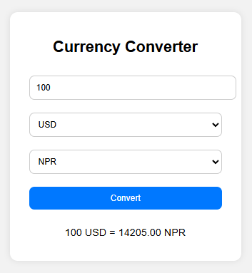

# 💱 Currency Converter

A simple web-based currency converter built with *HTML, CSS, and JavaScript*.  
It lets users convert between different currencies using real-time exchange rates.

---

## 📖 Features
- Live exchange rates  
- 150+ currencies  
- Simple and responsive design  
- No external libraries needed  

---

## ⚙ How to Use
1. Enter amount  
2. Select currencies  
3. Click *Convert* to get result  

---

## 🧠 Tech Used
HTML | CSS | JavaScript (Fetch API)

---

## 📸 Screenshot

---

## 🌐 Live Demo
[View on GitHub Pages](https://xyzvikram.github.io/currency-converter)
